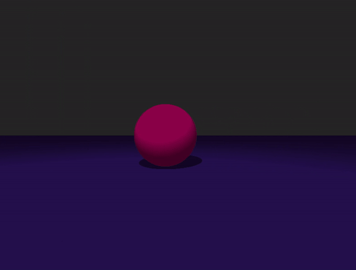
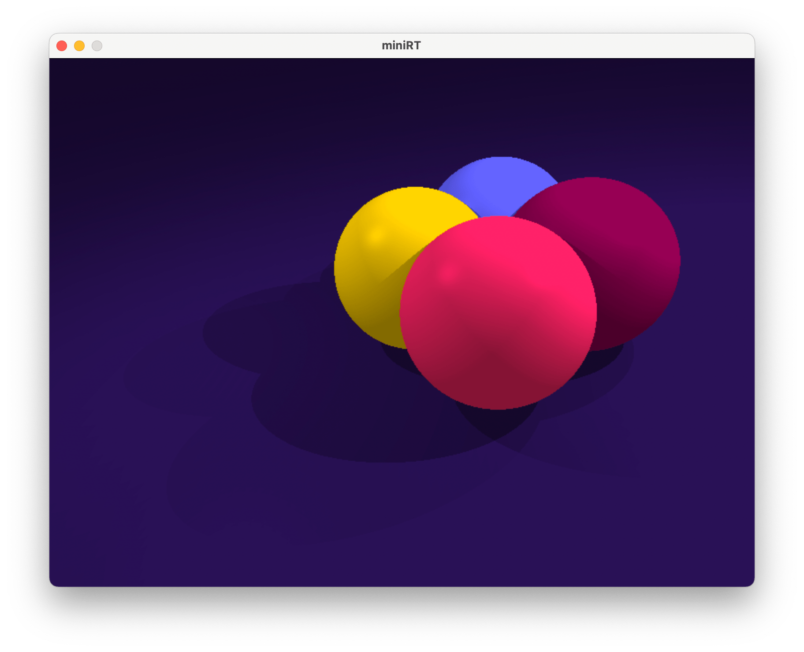
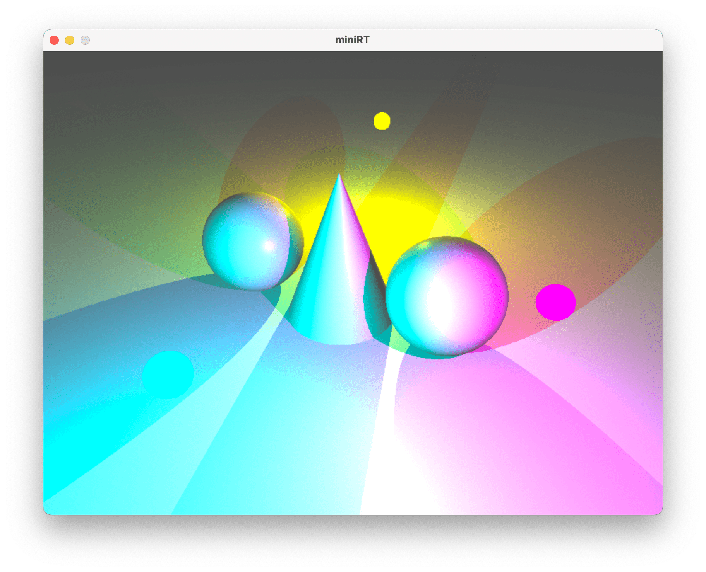
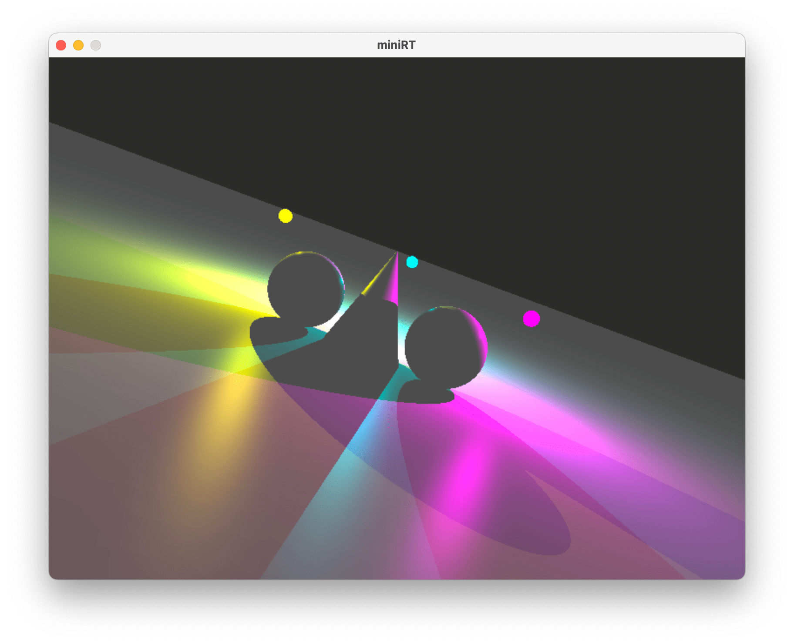
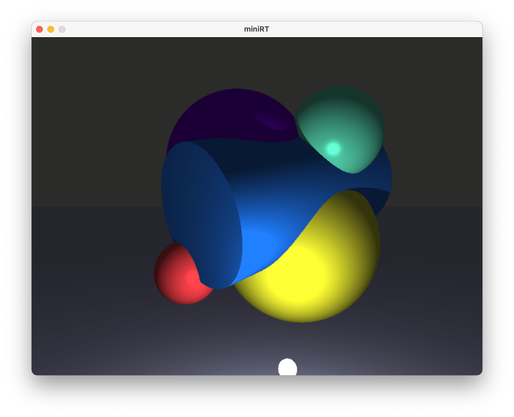
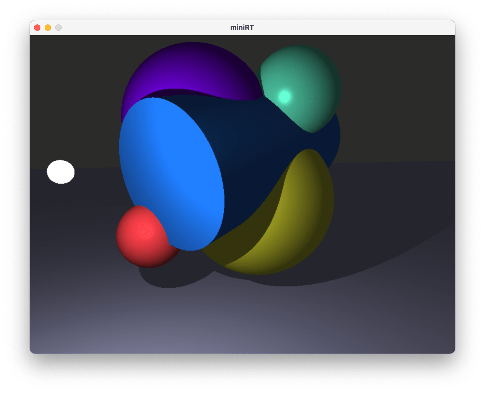
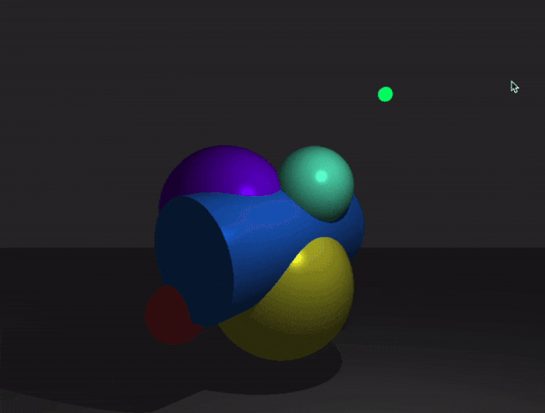
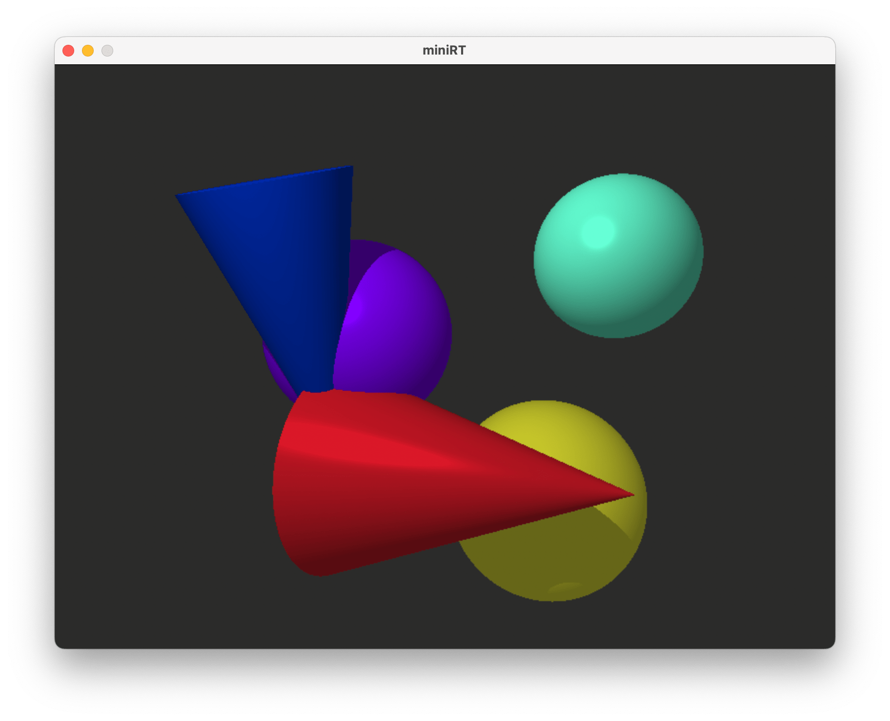

_This is a **21 School/Ecole 42** Project_

# miniRT (Raytracing)

MiniRT is a program that can render 3D scenes using raytracing technique using [MiniLibX](https://harm-smits.github.io/42docs/libs/minilibx/introduction.html) library. Subject can be found [here](https://cdn.intra.42.fr/pdf/pdf/47303/en.subject.pdf).

## Project goals

* Get familiar with raytracing
* Render 3D scenes with geometric objects using linear algebra
* Work with light, shading and texturing
* Implement scene navigation, object selection and modification



## To compile and run
Run the following commands in Terminal:
```shell
# to build
> make

# to run
> ./miniRT scenes_checklist/test01-sphere.rt 
```

The program accepts one `.rt` file as argument. Scene description files can be found at `scenes_checklist/` folder. Scene includes Ambient lightning, Camera, one or more coloured Spot lights, and geometry objects (`spheres`, `planes`, `cylliners` and `cones`).

To close window press `esc`.

## Scene control
| <h3>Camera movement</h3> | <h3>Object modification</h3> |
| ------------------------ | ---------------------------- |
|  | Click `[left mouse button]` to select/deselect object|
|  |
| Use `[a]` & `[d]` to move left or right | Use `[1]` & `[2]` to increase/decrease object radius |
| Use `[q]` & `[e]` to move up and down | Use `[3]` & `[4]`  to increase/decrease object height |
| Use `[w]` & `[s]` to move forwards or backwards | Use `[+]` & `[-]` to increase/decrease light brightness |
|  |
| Press `[↑]` rotatate camera upwards | Press `[T]` apply/discard texture |
| Press `[↓]` rotatate camera downwards | Press `[B]` apply/discard bump |
| Press `[←]` rotatate camera left | Press `[C]` apply/discard checkerboard |
| Press `[→]` rotatate camera right |

## Reneder examples









## Useful links

* All the useful [formulas](https://hugi.scene.org/online/hugi24/coding%20graphics%20chris%20dragan%20raytracing%20shapes.htm)
* Basic [lighting](https://learnopengl.com/Lighting/Basic-Lighting)
